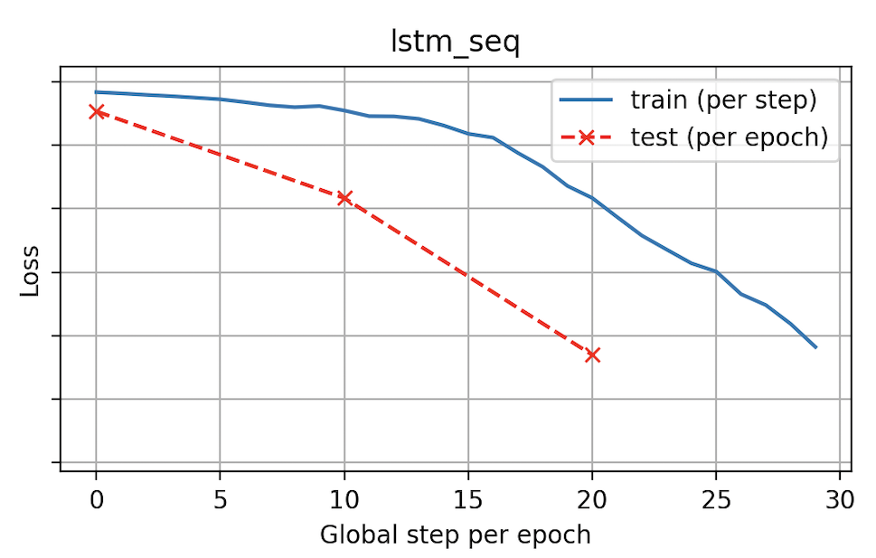

# Pico-LLM Sanity Checks and Core Implementations

## **Question 1.** Sanity check: running the baseline code (LSTM on TinyStories and 3seq)

### Configurations - 

**(a) LSTM on TinyStories**

- tinystories_weight : 1.0
- Num of epochs : 3
- n_heads : 8
- n_blocks : 6
- batch_size : 16
- learning_rate : 1e-3
- block_size : 32
- embed_size : 128
- max_steps_per_epoch : 10
- test_fraction : 0.1


**(b) LSTM on 3seqs input file**

- tinystories_weight : 1.0
- input_files : 3seqs.txt
- Num of epochs : 3
- n_heads : 8
- n_blocks : 6
- batch_size : 16
- learning_rate : 1e-3
- block_size : 32
- embed_size : 128
- max_steps_per_epoch : 10
- test_fraction : 0.1


### Plot

TinyStories training sanity (train/test loss over epochs):

**Train loss per step + test loss per epoch**


3seqs.txt training sanity (train/test loss over epochs):

**Train loss per step + test loss per epoch**


These runs verify that the provided training loop, data pipeline, and generation code all work as expected. 

Both train and test loss decrease over epochs (see the plot above), which confirms that the LSTM.

---

## **Question 2.** KGramMLPSeqModel + sanity checks (one-hot vs embedding)

### Configurations

- tinystories_weight : 1.0
- input_files : 3seqs.txt
- Num of epochs : 3
- n_heads : 8
- n_blocks : 6
- batch_size : 16
- learning_rate : 1e-3
- kgram_k : 3
- num_inner_mlp_layers : 1
- kgram_chunk_size : 1
- block_size : 32
- embed_size : 128
- max_steps_per_epoch : 10
- test_fraction : 0.1

**(a) K-gram MLP on 3seq with one-hot inputs**

**Train loss per step + test loss per epoch**


**(b) K-gram MLP on 3seq with `nn.Embedding`**

**Train loss per step + test loss per epoch**


### Explanation - 

Both runs use the same k-gram architecture and training loop but differ in how token context is represented. 

In the one-hot version, training loss decreases extremely slowly, indicating poor optimization and a very high-dimensional input space. 

In the embedding version, the loss drops quickly and the train/test curves behave well. This demonstrates that the sequence-to-sequence k-gram implementation is correct and that using `torch.nn.Embedding` is both efficient and beneficial for learning.

---

**(c) K-gram MLP on 3seq trained with final configurations**

### Configurations

- tinystories_weight : 0.0
- input_files : 3seqs.txt
- Num of epochs : 15
- n_heads : 8
- n_blocks : 6
- batch_size : 16
- learning_rate : 3e-4
- kgram_k : 3
- num_inner_mlp_layers : 1
- kgram_chunk_size : 1
- block_size : 1024
- embed_size : 128
- max_steps_per_epoch : 210
- test_fraction : 0.1

**Train loss per step + test loss per epoch**


## 3. **Question 3.** Nucleus (top-p) sampling

### Configurations

- tinystories_weight : 0.0
- input_files : 3seqs.txt
- Num of epochs : 15
- n_heads : 8
- n_blocks : 6
- batch_size : 16
- learning_rate : 3e-4
- kgram_k : 3
- num_inner_mlp_layers : 1
- kgram_chunk_size : 1
- block_size : 1024
- embed_size : 128
- max_steps_per_epoch : 210
- test_fraction : 0.1

### Nucleus Sampling Output Table using the trained 3seq.txt on various top-p values for kgram_mlp_seq:

| Top-p Value | Generated Output (for last epoch)                                                                |
|-------------|-----------------------------------------------------------------------------------|
| Greedy      | 0 1 2 3 4 5 6 7 8 9 10 11 12 13 14 15 16 17 18 19 20 21 22 23 24                  |
| 0.2         | 0 1 2 3 4 5 6 7 8 9 10 11 12 13 14 15 16 17 18 19 20 21 22 23 24                  |
| 0.5         | 0 1 2 3 4 5 6 7 8 9 10 11 12 13 14 15 16 17 18 19 20 21 22 23 24                  |
| 0.75        | 0 1 2 3 4 5 6 7 8 9 10 11 12 13 14 15 16 17 18 19 20 21 22 23 24                  |
| 0.95        | 0 1 2 3 4 5 6 7 8 9 10 11 12 13 14 15 16 17 18 19 20 21 22scans                  |
| 1.0         | 0 1 2 3 4 5 6 7 8 9 10 11 12 13 14 15 16 17ometers oxidative 146                |


### Configurations

- tinystories_weight : 1.0
- Num of epochs : 10
- n_heads : 8
- n_blocks : 6
- batch_size : 16
- learning_rate : 3e-4
- kgram_k : 3
- num_inner_mlp_layers : 1
- kgram_chunk_size : 1
- block_size : 512
- embed_size : 512
- max_steps_per_epoch : 750
- test_fraction : 0.1


### Nucleus Sampling Output Table using the tinystories data on various top-p values for kgram_mlp_seq:


| Top-p Value | Generated Output (for last epoch)                                                                                    |
|-------------|------------------------------------------------------------------------------------------------------|
| Greedy      | Once upon a time, there was a little girl named Lily. She loved to play outside and explore the world around her |
| 0.2         | Once upon a time, there was a little girl named Lily. She loved to play outside and explore the world around her |
| 0.5         | Once upon a time, there was a little girl named Lily. She loved to eat cherries, especially the soft ones        |
| 0.75        | Once upon a time, there was a dog named Max. Max loved to play with his owner, a lot. His                        |
| 0.95        | Once upon a time, there was a little girl named Lily. She loved to run and play outside and run around with      |
| 1.0         | Once upon a time, there were two friends Jack and Annie. They loved to play together and think. Today was special    |


### Explanation

As the `top-p` value increases, the generated text becomes more diverse and creative. Lower values like `0.2` or `0.5` stick closely to greedy decoding, while higher values like `0.75`, `0.95` and `1.0` allow the model to explore alternative continuations.

---

## 4. TransformerModel: causal decoder-only transformer with RMSNorm

### Configurations

- tinystories_weight : 0.0
- input_files : 3seqs.txt
- Num of epochs : 15
- n_heads : 8
- n_blocks : 6
- batch_size : 16
- learning_rate : 3e-4
- block_size : 1024
- embed_size : 128
- max_steps_per_epoch : 210
- test_fraction : 0.1

### Plot

Transformer on 3seq sanity plot (train/test loss):


### 3seq.txt – Perfect Fit with Low Generalization Risk
For the 3seq.txt dataset, both training and test loss drop sharply within the first few hundred steps and plateau close to zero.

### Configurations

- tinystories_weight : 1.0
- Num of epochs : 10
- n_heads : 8
- n_blocks : 6
- batch_size : 16
- learning_rate : 3e-4
- block_size : 512
- embed_size : 512
- max_steps_per_epoch : 750
- test_fraction : 0.1

### Plot

Transformer on tinystories sanity plot (train/test loss):


### Tinystories – Perfect Fit with Low Generalization Risk
In the TinyStories training curve, we observe that while the training loss steadily decreases over the global steps, the test loss flattens early and begins to slightly increase in the later epochs. (Maybe overfitting)

# Optional Tasks

# Q1. Own Dataset - 

We used a custom subset of 30,000 lines from the hugging face Wikipedia corpus dataset as our training data to study model behavior on long-form, factual text beyond TinyStories enabling the model to learn from longer, information-rich sentences and diverse real-world topics.

### Configuration - 

- wiki_weight : 1.0
- n_heads : 16
- n_blocks : 8
- batch_size : 16
- learning_rate : 3e-4
- block_size : 512
- embed_size : 1024
- test_fraction : 0.1
- epochs : 15
- max_steps_per_epoch : 1500


Overfit so decreasing epochs according to the image to around 4500 global steps.

### Configuration - 

- wiki_weight : 1.0
- n_heads : 16
- n_blocks : 8
- batch_size : 16
- learning_rate : 3e-4
- block_size : 1024
- embed_size : 1024
- test_fraction : 0.1
- epochs : 3
- max_steps_per_epoch : 1500


# Q2. Overfitting vs Underfitting
### Configuration - 

- tinystories_weight : 1.0
- n_heads : 16
- n_blocks : 8
- batch_size : 16
- learning_rate : 3e-4
- block_size : 512
- embed_size : 1024
- test_fraction : 0.1

## Quantitative analysis

### For Underfitting -


#### Configuration:
epochs = 3 | max_steps_per_epoch = 100

#### Observation:

- Both train and test losses remain high (~ 2–2.5) and closely aligned.

- The loss curve flattens early, indicating that the model stops improving after very few updates.

- The small gap between train and test losses suggests the model is not learning enough patterns to differentiate training vs unseen data.

- Fails to capture even training regularities.

### For Overfitting -


#### Configuration:
epochs = 15 | max_steps_per_epoch = 2500

#### Observation:

- Training loss drops sharply (≈ 10 → 0.3) while test loss initially decreases but then stabilizes or slightly rises (~ 1.0–1.2). 

- A clear gap forms between train and test curves as training progresses. The widening gap between training and test losses quantitatively demonstrates overfitting.

- The model’s performance on unseen data ceases to improve even though training loss keeps falling. The model has begun to memorize the training samples instead of learning generalizable patterns.


## Qualitative analysis

### For Underfitting -

```
Prompt: Once upon a time 
```
```
Generated text: Once upon a time, there was a little girl named Lily. She had a ball forest that her mum they would play with her mommy and new on her shoes and asked her favorite things. She was a circle, she was very brave.

Her mommy didn't mind, her medicine the safest her mum loved to visit it. Lily's mom took the bushes and or jumple to learn her new friends feel better. Lily and wanted to cactus.

After they picked up because they got very clever that it forgot in the garden and hopped over and whist down so much fun. They played together with past and watched the Jill remembered, "Did you."
```

### For Overfitting -

```
Prompt: Once upon a time 
```
```
Generated text: Once upon a time, there were two friends, Bobby and Milly. Bobby was a jolly little boy who loved to play with him. One day, Bobby wanted to play with his laser so he asked Milly if he could play with him. Milly said yes and he was so excited. So Bobby and Milly played with the laser together. They had so much fun and laughed until they both started to get tired. Bobby invited his friend to join her in the garden. When they had finished playing, Bobby said “Let's have a rest under the sun.†Lilly agreed and they both said “Let's have a great day!†And so Bobby and Milly spent the day playing with the laser and having lots of fun. Bobby and Milly had so much fun that day. The end!!!!!!!!!!!!!!!!!
```
#### Observations

| Condition    | Qualitative output                    | Diversity             | Evidence of Memorization |
| ------------ | ----------------------------------- | --------------------- | ------------------------ | 
| **Underfit** | Poor – incoherent, broken sentences since training pattern is not established | Random/illogical      | None                     | 
| **Overfit**  | High fluency, grammatical but memorized training patterns instead of generalizing it          | Very low – repetitive | Strong                   |

# Q3. Change in Hyperparameters - Embed size
### Configuration - 

Taking the 2 configurations of the custom wiki dataset where one has 512 embed size and one has 1024 embed size - 


The model with **embedding size 1024** converges noticeably faster, showing a steeper decline in loss across the first three epochs. This happens because larger embeddings offer greater expressive power and smoother optimization dynamics, enabling the model to capture token relationships more effectively early in training. In contrast, the **512-dimensional** model learns more slowly and plateaus higher, reflecting its lower representational capacity.


# Q5. Interpretability: Analyzing Attention Head Behavior

To understand the internal mechanisms of the trained Transformer, we analyzed the attention patterns of specific heads. We collected the attention matrices while processing the following prompt:

> **PROMPT:** "Once upon a time, there was a little girl named Lily who loved to play outside."

### Configuration 

- tinystories_weight : 1.0
- Num of epochs : 10
- n_heads : 8
- n_blocks : 6
- batch_size : 16
- learning_rate : 3e-4
- block_size : 512
- embed_size : 512
- max_steps_per_epoch : 750
- test_fraction : 0.1
* **Layer (Block Index):** 0
* **Head Index:** 0
* **Prompt Token Length:** 17

### Attention Map Visualization: Layer 0, Head 0


The plot shows the attention weight ($W_{q,k}$) assigned by a query token at position $q$ (Y-axis) to a key token at position $k$ (X-axis). Darker colors indicate low weight, while yellow/green indicates high weight (up to 1.0).

### Detailed Analysis and Interpretation

Layer 0, Head 0 exhibits patterns characteristic of an early layer: establishing positional context and gathering fundamental grammatical information.

#### 1. Positional Indexing and Local Context (High-Weight Diagonals)

The earliest query tokens (e.g., $q=0$ to $q=4$) show extremely high attention weights (yellow, $\approx 1.0$) to the immediately preceding tokens, including position $k=0$. This is a typical **Context Establishment** mechanism, ensuring each token is strongly aware of its immediate local neighborhood and the sentence start.

#### 2. Focus on Auxiliary/Grammatical Tokens

The head demonstrates a tendency to focus attention on key positions holding grammatical or auxiliary words. This is visible as vertical bands in the heatmap (e.g., around $k=6$ and $k=7$).

#### 3. Specific Query Analysis: `' girl'` (Position 9)

By inspecting the top keys attended to by the query token `' girl'` at position $q=9$, we can infer the head's specific function:

| Key Position | Token | Attention Weight |
| :---: | :---: | :---: |
| 6 | `' was'` | 0.280 |
| 3 | `' time'` | 0.202 |
| 8 | `' little'` | 0.190 |
| 7 | `' a'` | 0.170 |

**Interpretation:** The head is not simply looking at the most recent token (like `' little'`), but actively gathering foundational context elements:
* It attends to the **verb** (`' was'`) that establishes the existence of the subject.
* It attends to the **determiner** (`' a'`) and the **adjective** (`' little'`).
* It looks back to the start of the introductory phrase (`' time'`).

This suggests Layer 0, Head 0 acts as a **Grammatical Marker Tracker** or **Early Context Integrator**, providing subsequent layers with a compressed, low-level representation of the noun phrase and its setting.